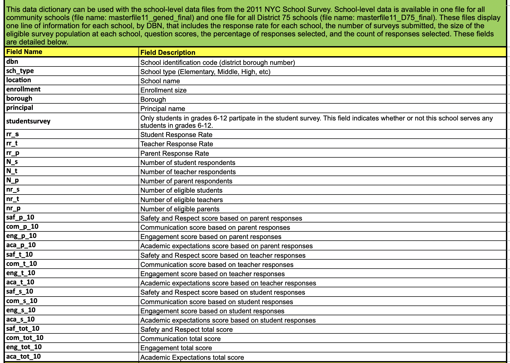

# Setup
```{r setup, include=FALSE}
knitr::opts_chunk$set(echo = TRUE)
```

First we will load the libraries we need for this analysis.
```{r libraries, message=FALSE}
library(tidyverse)
library(janitor)
library(corrplot)
```

# Scope
*Amended from the [Dataquest tutorial blog][1]*

In this project, we look at the [SAT scores][2] of high schoolers in New York City, along with various demographic and other information about them. The SAT, or Scholastic Aptitude Test, is a test that high schoolers take in the US before applying to college. Colleges take the test scores into account when making admissions decisions, so it’s fairly important to do well on. The test is divided into 3 sections, each of which is scored out of 800 points. The total score is out of 2400 (although this has changed back and forth a few times, the scores in this dataset are out of 2400). High schools are often ranked by their average SAT scores, and high SAT scores are considered a sign of how good a school district is.

There have been [allegations][3] about the SAT being unfair to certain racial groups in the US, so doing this analysis on New York City data will help shed some light on the fairness of the SAT.

# Understanding the data
We are using data on the SAT scores of high schoolers, along with other data sets relating to demographics and other information.

Let's read each data file into a df.
```{r read, echo=TRUE, message=FALSE, warning=FALSE, results='hide'}
# Get the list of files to read in
files <- list.files(path = "data-in", pattern = "*.csv", full.names = TRUE)

# Extract the data set names from the filenames. We can use these to name
# elements in our list of df
names <- str_extract(files, "(?<=data-in\\/)(.+)(?=\\.csv)")

# Read in all files to a list of df
# The setNames function will apply the filename as the name of each element
# in the list
data <- setNames(lapply(files, read_csv), names)
```
Once we have read in the data, we can use the `names` function to see the column names in each df.
```{r head, echo=TRUE}
lapply(data, names)
```
Some items of interest from this initial peek:

* Many of the column headings are capitalized and contain spaces. To make things easier in R, I will need to clean them.
* Most of the data sets contain a `DBN` column which appears to be a unique identifier for the school.
* Some of the data sets contain records for more than one year, others are for a single year.
* Some of the columns may need further cleaning (e.g. percentages may need to be divided by 100)

## Cleaning the column headings
The `janitor` package has a handy function called `clean_names()` that will ensure column names are unique and consist only of the `_` character, numbers and lowercase letters.
```{r clean names}
data <- 
  lapply(data, clean_names)
```


# Unifying the data
Our next step is to combine the different data sets in to one large dataframe, so that we can compare columns across data sets. It looks like we may be able to use `dbn` as a joining column.

However, some data sets do not have a `dbn` column:

* `class_size`: it looks like we can construct the `dbn` by using a combination of `csd`, `borough` and `school_code`.
* `district_maps` and `school_attendance`: these data sets appear to be aggregated at the school district level rather than the individual school level.

## Adding `dbn` to `class_size`
Let's take a look at `dbn` in one of the other data sets where it appears.
```{r dbn}
head(data$sat_scores$dbn)
```
As [this article][4] explains, the DBN or District Borough Number is the combination of District Number, the letter code for the borough and the number of the school.


Let's look again at the column headings we have in the `class_size` df.
```{r class_size names}
names(data$class_size)
```
From the [data dictionary][5] that accompanies this data set on the [NYC Open Data][6] site, I know that `csd` is the Community School District number, `borough` is the borough code and `school_code` is the school code. 

Let's have a look at how these columns look in the `class_size` df.
```{r class_size DBN columns}
data$class_size %>% 
  select(csd, borough, school_code) %>% 
  head()
```
So it looks like in this case the `school_code` column is already a concatenation of the borough code and the school code. We simply need to add the district number, with a leading 0.
```{r class_size add dbn}
data$class_size <- 
  data$class_size %>% 
  mutate(dbn = paste0(str_pad(csd, 2, side = "left", pad = "0"), school_code)) %>% 
  select(dbn, everything()) # puts the new dbn column at the front

head(data$class_size$dbn)
```

## Adding in the surveys
We also have some data relating to student, parent and teacher surveys about the quality of schools. These surveys include information about the perceived safety of each school, academic standards and more. We will need to add in this data before we can combine the data sets. The survey data is located in two `.txt` files in the `data-in` directory. These are tab-delimited files and we can read them in using `read_tsv()`.
```{r read surveys, message=FALSE, warning=FALSE}
# Get the list of files to read in 
survey_files <- list.files(path = "data-in", pattern = "*.txt", full.names = TRUE)

# Extract the data set names from the filenames. We can use these to name
# elements in our list of df
survey_names <- str_extract(survey_files, "(?<=data-in\\/)(.+)(?=\\.txt)")

# Read in all files to a list of survey data
survey_data <- setNames(lapply(survey_files, read_tsv), survey_names)
```

There are actually far too many columns in the survey data to be useful for our analysis. We can resolve this issue by looking at the [data dictionary][7] file that accompanies this data set on the [NYC Open Data][6] site. We'll use the list of fields in the first section of the data dictionary for our analysis.



```{r filter survey}
# First we'll select the columns we need from the survey_all data
survey_data$survey_all <-
  survey_data$survey_all %>% 
  select(dbn:aca_tot_11)

# Then we'll select the columns we need from the survey_d75 data
survey_data$survey_d75 <- 
  survey_data$survey_d75 %>% 
  select(dbn:aca_tot_11)
```

Now it looks like both of these df have the same column headings, so we can bind them into a single df and append that df to the main data list.

```{r append survey}
# Bind the two survey df into one df and clean the names
survey_data <- survey_data %>% 
  bind_rows() %>% 
  clean_names()

# Append the survey data to the data list
data <- c(data, survey = list(survey_data))
```

## Condensing the data sets
If we take a look at some of the data sets, including `class_size` we'll immiediately see a problem.

```{r class size dupes}
head(data$class_size)
```

There are several rows for each high school (as you can see by the repeated `school_code` field). In order to combine this data set with the SAT scores data, we need to be able to condense data sets like `class size` to the point where there is just one row per school. In the `class_size` data set it looks like `grade` and `program_type` have multiple values per school. By restricting each field to a single value, we can filter most of the duplicate rows. Let's filter `class_size` as follows:

* Only select records where `grade` is `09-12`
* Only select records where `program_type` is `GEN ED`
* Group the `class_size` data set by `dbn`, and take the average of each column. Essentially we will find the average class size for each school.
```{r class size filter}
data$class_size <- data$class_size %>% 
  filter(grade == "09-12",
         program_type == "GEN ED") %>% 
  select(dbn, where(is.numeric)) %>% 
  group_by(dbn) %>% 
  summarise(across(everything(), mean))
```

Let's check that this has removed all of the duplicate `dbn` in the `class_size` data set.
```{r class size dupes remaining}
anyDuplicated(data$class_size$dbn)
```

Some of the other data sets also need to be condensed. In the `demographics` data set, data was collected for multiple years for the same school. Let's filter to include only the most recent year for each school. We can then run the same check for any remaining duplicated `dbn`.
```{r condense demographics}
data$demographics <- data$demographics %>% 
  filter(schoolyear == "20112012")

anyDuplicated(data$demographics$dbn)
```

In the `math_results` data set, schools are further segmented by `grade` and `year`. We can select a single grade and a single year.
```{r condense math}
data$math_results <- data$math_results %>% 
  filter(year == 2011,
         grade == "8")

anyDuplicated(data$math_results$dbn)
```

Finally, `grad_outcomes` needs to be condensed.
```{r condense grad_outcomes}
data$grad_outcomes <- data$grad_outcomes %>% 
  filter(cohort == "2006",
         demographic == "Total Cohort")

anyDuplicated(data$grad_outcomes$dbn)
```

We have checked a few of our data sets for duplicated `dbn` but we haven't checked all of them. Let's write a function to check everything.
```{r}
duplicate_check <- 
  function(df) {
    anyDuplicated(df$dbn)
  }

lapply(data, duplicate_check)
```

Look's like something funny is going on with `ap_results`. Let's take a closer look.
```{r ap_results}
data$ap_results %>% 
  group_by(dbn) %>% 
  mutate(dbn_count = n()) %>% 
  filter(dbn_count > 1) %>% 
  print()
```
It looks like this school has been entered twice. One of the rows has no data so we can remove this row.
```{r filter ap_results}
data$ap_results <- data$ap_results %>% 
  filter(school_name != "YOUNG WOMEN'S LEADERSHIP SCH")

anyDuplicated(data$ap_results$dbn)
```

# Computing variables
Computing variables can help speed up our analysis by enabling us to make comparisons more quickly. We can compute a total SAT score from the individual columns `sat_critical_reading_avg_score`, `sat_math_avg_score` and `sat_writing_avg_score`. Before we can do this we will need to convert those columns from string to number.
```{r compute total SAT score, message=FALSE, warning=FALSE}
data$sat_scores <- data$sat_scores %>% 
  mutate(across(num_of_sat_test_takers:sat_writing_avg_score, as.numeric)) %>% 
  mutate(sat_score = sat_critical_reading_avg_score +
                     sat_math_avg_score +
                     sat_writing_avg_score)

head(data$sat_scores)
```

Next, let's parse out the coordinate locations of each school, so we can make maps. This will enable us to plot the location of each school. Let's take a look at the `location_1` column in `hs_directory` where these coordinates are stored
```{r location_1}
head(data$hs_directory$location_1)
```

The coordinates all appear to follow a newline character (`\n`) and an opening parenthesis (`(`).
```{r parse coords}
data$hs_directory <- data$hs_directory %>% 
  mutate(lat = as.numeric(str_extract(location_1, "(?<=\\\n\\()(-*\\d+\\.\\d+)")),
         lon = as.numeric(str_extract(location_1, "(-*\\d+\\.\\d+)(?=\\)$)")))

data$hs_directory %>% 
  select(lat, lon) %>% 
  head()
```

# Combining the data sets
Now we are ready to combine our data sets into one large dataframe using the `dbn` column. We will need to perform a `full_join` to ensure that we don't lose any data, since not all schools are present in all data sets.
```{r join data sets}
full <- data$hs_directory %>% 
  full_join(data$ap_results,
            by = "dbn") %>% 
  full_join(data$class_size,
            by = "dbn") %>% 
  full_join(data$demographics,
            by = "dbn") %>% 
  full_join(data$grad_outcomes,
            by = "dbn") %>% 
  full_join(data$math_results,
            by = "dbn") %>%
  full_join(data$sat_scores,
            by = "dbn") %>% 
  full_join(data$survey,
            by = "dbn")

head(full)
```

# Adding in columns
Now that we have our `full` data frame we are almost ready to do our analysis. We first need to check for missing data. Some of the AP scores data has missing values. We can convert these to 0.
```{r AP replace na}
full <- full %>% 
  replace_na(list(ap_test_takers = 0,
                  total_exams_taken = 0,
                  number_of_exams_with_scores_3_4_or_5 = 0))

full %>% 
  select(c(ap_test_takers, total_exams_taken, number_of_exams_with_scores_3_4_or_5)) %>% 
  head()
```

Next we need to add a `school_dist` column that indicates the school district of the school. this will enable us to match up school districts and plot out district level statistics using the district maps we downloaded earlier. Recalling our [earlier image][8], this can be extracted from the `dbn` column by taking the first 2 characters from the DBN code.

```{r extract school_dist}
full <- full %>% 
  mutate(school_dist = str_sub(dbn,1,2))

head(full$school_dist)
```

# Computing correlations
A good way to explore a data set and see what columns are related to the one you care about is to compute correlations. In this case we are interested in the `sat_score` column.

In order to do this we will need to impute any missing values in the numerical columns. We will simply use the column mean as our imputed value.
```{r compute correlations, message=FALSE, warning=FALSE}
# Select only numeric columns
full_num <- full %>% 
  select(where(is.numeric))

# Impute missing values
#full_num <- full_num %>% 
#  mutate(across(everything(),
#                ~ if_else(is.na(.x), mean(.x, na.rm = TRUE), .x)))

# Create a dataframe of correlation coefficients (r)
# Every variable is correlated against every other
full_cor <- as_tibble(cor(full_num, use = "pairwise.complete.obs", method = "pearson"),
                      rownames = "variable")

# Select just the sat_score correlations
sat_cor <- full_cor %>% 
  select(variable, sat_score)
```

One [widely accepted interpretation][9] of correlation coefficients states that anything with an absolute coefficient of 0.4 or above can be considered to be moderately correlated.

Let's just show the variables that are correlated moderately or above with `sat_score`. We can remove `sat_score` from the variable column (since this just shows how `sat_score` is correlated with itself) along with the columns that factored into the `sat_score` calculation as we know they will also be correlated.

```{r sat_score correlations}
sat_cor %>% 
  filter(!variable %in% c("sat_score",
                          "sat_writing_avg_score",
                          "sat_critical_reading_avg_score",
                          "sat_math_avg_score"),
         sat_score >= 0.4 | sat_score <= -0.4) %>% 
  arrange(desc(sat_score))
```

Given that one of our initial research questions was to explore any relationships between race and SAT scores, let's also do a deeper dive into some of the demographic variables. We can plot a few of these on scatter plots alongside SAT score.

Let's define a function to draw our scatter plots
```{r scatter function}
scatter <- function(x,y) {
  plot(x, y, pch = 19, col = "lightblue")
  abline(lm(y ~ x), col = "red", lwd = 3)
  text(paste("Correlation:", round(cor(x, y, use = "complete.obs"), 2)), x = 60, y = 1000)
}
```

Now let's plot percent of white students against SAT score.
```{r scatter white, echo=FALSE, message=FALSE, warning=FALSE}
scatter(full$white_per, full$sat_score)
```

Percent of Asian students against SAT acores.
```{r scatter asian, echo=FALSE, message=FALSE, warning=FALSE}
scatter(full$asian_per, full$sat_score)
```

Percent of hispanic students against SAT score.
```{r scatter hispanic, echo=FALSE, message=FALSE, warning=FALSE}
scatter(full$hispanic_per, full$sat_score)
```

And percent of black students.
```{r scatter black, echo=FALSE, message=FALSE, warning=FALSE}
scatter(full$black_per, full$sat_score)
```

# Setting the context
Let's build a map of where the schools are located in NYC.

[1]: <https://www.dataquest.io/blog/data-science-portfolio-project/> "Data Science Portfolio Tutorial by Dataquest.io"
[2]: <https://en.wikipedia.org/wiki/SAT> "SAT wiki"
[3]: <https://www.brookings.edu/research/race-gaps-in-sat-scores-highlight-inequality-and-hinder-upward-mobility/> "Race gaps in SAT scores"
[4]: <https://teachnyc.zendesk.com/hc/en-us/articles/360053601831-What-is-a-DBN-District-Borough-Number-> "NYC DBN"
[5]: <https://data.cityofnewyork.us/api/views/urz7-pzb3/files/73f3bc71-a52a-4a80-b496-ab2a43b8021f?download=true&filename=Class_Size_Open_Data_Dictionary.xlsx> "Class size data dictionary"
[6]: <https://opendata.cityofnewyork.us/> "NYC Open Data"
[7]: <https://data.cityofnewyork.us/api/views/mnz3-dyi8/files/aa68d821-4dbb-4eb2-9448-3d8cbbad5044?download=true&filename=Survey%20Data%20Dictionary.xls> "Survey data dictionary"
[8]: <https://teachnyc.zendesk.com/hc/article_attachments/360079392731/Screen_Shot_2020-12-10_at_10.55.35_AM.png> "DBN Explainer"
[9]: <http://www.statstutor.ac.uk/resources/uploaded/pearsons.pdf> "Interpreting correlation coefficients"
