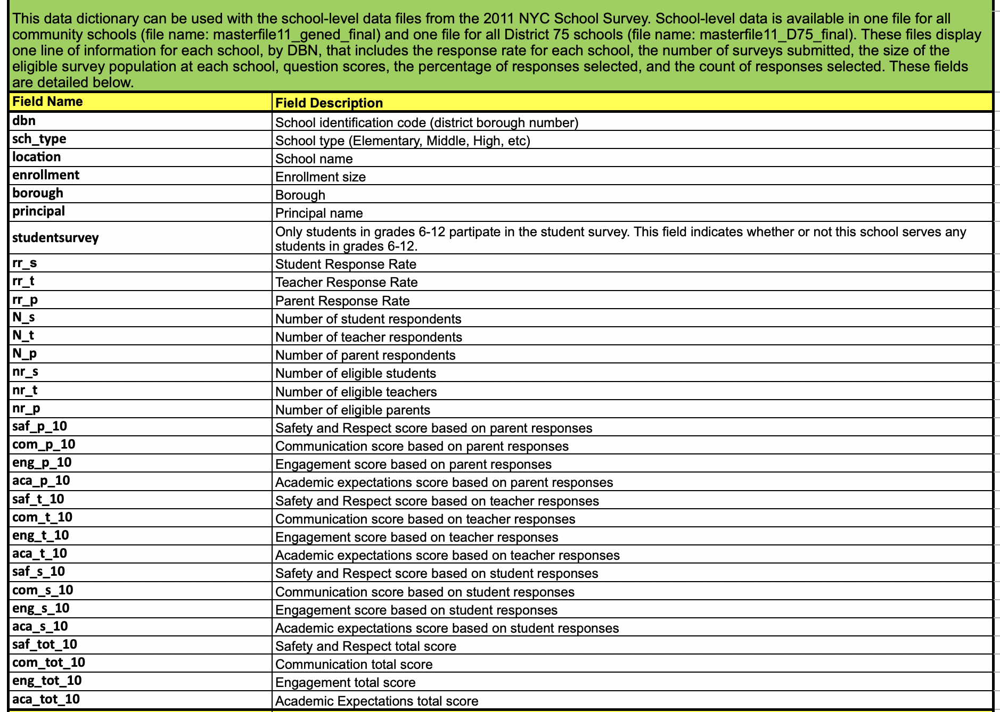

NYC SAT Scores
================
Clare Gibson
2021-05-13

# Setup

First we will load the libraries we need for this analysis.

``` r
library(tidyverse)
library(janitor)
```

# Scope

*Amended from the [Dataquest tutorial
blog](https://www.dataquest.io/blog/data-science-portfolio-project/ "Data Science Portfolio Tutorial by Dataquest.io")*

In this project, we look at the [SAT
scores](https://en.wikipedia.org/wiki/SAT "SAT wiki") of high schoolers
in New York City, along with various demographic and other information
about them. The SAT, or Scholastic Aptitude Test, is a test that high
schoolers take in the US before applying to college. Colleges take the
test scores into account when making admissions decisions, so it’s
fairly important to do well on. The test is divided into 3 sections,
each of which is scored out of 800 points. The total score is out of
2400 (although this has changed back and forth a few times, the scores
in this dataset are out of 2400). High schools are often ranked by their
average SAT scores, and high SAT scores are considered a sign of how
good a school district is.

There have been
[allegations](https://www.brookings.edu/research/race-gaps-in-sat-scores-highlight-inequality-and-hinder-upward-mobility/ "Race gaps in SAT scores")
about the SAT being unfair to certain racial groups in the US, so doing
this analysis on New York City data will help shed some light on the
fairness of the SAT.

# Understanding the data

We are using data on the SAT scores of high schoolers, along with other
data sets relating to demographics and other information.

Let’s read each data file into a df.

``` r
# Get the list of files to read in
files <- list.files(path = "data-in", pattern = "*.csv", full.names = TRUE)

# Extract the data set names from the filenames. We can use these to name
# elements in our list of df
names <- str_extract(files, "(?<=data-in\\/)(.+)(?=\\.csv)")

# Read in all files to a list of df
# The setNames function will apply the filename as the name of each element
# in the list
data <- setNames(lapply(files, read_csv), names)
```

Once we have read in the data, we can use the `glimpse` function to get
a peek at the data in each df.

``` r
lapply(data, glimpse)
```

    ## Rows: 258
    ## Columns: 5
    ## $ DBN                                    <chr> "01M448", "01M450", "01M515", "…
    ## $ SchoolName                             <chr> "UNIVERSITY NEIGHBORHOOD H.S.",…
    ## $ `AP Test Takers`                       <dbl> 39, 19, 24, 255, NA, 21, 99, 42…
    ## $ `Total Exams Taken`                    <dbl> 49, 21, 26, 377, NA, 21, 117, 4…
    ## $ `Number of Exams with scores 3 4 or 5` <dbl> 10, NA, 24, 191, NA, NA, 10, NA…
    ## Rows: 27,611
    ## Columns: 16
    ## $ CSD                                    <dbl> 1, 1, 1, 1, 1, 1, 1, 1, 1, 1, 1…
    ## $ BOROUGH                                <chr> "M", "M", "M", "M", "M", "M", "…
    ## $ `SCHOOL CODE`                          <chr> "M015", "M015", "M015", "M015",…
    ## $ `SCHOOL NAME`                          <chr> "P.S. 015 Roberto Clemente", "P…
    ## $ GRADE                                  <chr> "0K", "0K", "01", "01", "02", "…
    ## $ `PROGRAM TYPE`                         <chr> "GEN ED", "CTT", "GEN ED", "CTT…
    ## $ `CORE SUBJECT (MS CORE and 9-12 ONLY)` <chr> "-", "-", "-", "-", "-", "-", "…
    ## $ `CORE COURSE (MS CORE and 9-12 ONLY)`  <chr> "-", "-", "-", "-", "-", "-", "…
    ## $ `SERVICE CATEGORY(K-9* ONLY)`          <chr> "-", "-", "-", "-", "-", "-", "…
    ## $ `NUMBER OF STUDENTS / SEATS FILLED`    <dbl> 19, 21, 17, 17, 15, 17, 12, 15,…
    ## $ `NUMBER OF SECTIONS`                   <dbl> 1, 1, 1, 1, 1, 1, 1, 1, 2, 1, 1…
    ## $ `AVERAGE CLASS SIZE`                   <dbl> 19.0, 21.0, 17.0, 17.0, 15.0, 1…
    ## $ `SIZE OF SMALLEST CLASS`               <dbl> 19, 21, 17, 17, 15, 17, 12, 15,…
    ## $ `SIZE OF LARGEST CLASS`                <dbl> 19, 21, 17, 17, 15, 17, 12, 15,…
    ## $ `DATA SOURCE`                          <chr> "ATS", "ATS", "ATS", "ATS", "AT…
    ## $ `SCHOOLWIDE PUPIL-TEACHER RATIO`       <dbl> NA, NA, NA, NA, NA, NA, NA, NA,…
    ## Rows: 10,075
    ## Columns: 38
    ## $ DBN               <chr> "01M015", "01M015", "01M015", "01M015", "01M015", "0…
    ## $ Name              <chr> "P.S. 015 ROBERTO CLEMENTE", "P.S. 015 ROBERTO CLEME…
    ## $ schoolyear        <dbl> 20052006, 20062007, 20072008, 20082009, 20092010, 20…
    ## $ fl_percent        <dbl> 89.4, 89.4, 89.4, 89.4, NA, NA, NA, 61.5, 61.5, 61.5…
    ## $ frl_percent       <dbl> NA, NA, NA, NA, 96.5, 96.5, 89.4, NA, NA, NA, NA, 82…
    ## $ total_enrollment  <dbl> 281, 243, 261, 252, 208, 203, 189, 402, 312, 338, 32…
    ## $ prek              <dbl> 15, 15, 18, 17, 16, 13, 13, 15, 13, 28, 33, 35, 36, …
    ## $ k                 <dbl> 36, 29, 43, 37, 40, 37, 31, 43, 37, 48, 44, 48, 53, …
    ## $ grade1            <dbl> 40, 39, 39, 44, 28, 35, 35, 55, 45, 46, 56, 49, 53, …
    ## $ grade2            <dbl> 33, 38, 36, 32, 32, 33, 28, 53, 52, 47, 44, 56, 47, …
    ## $ grade3            <dbl> 38, 34, 38, 34, 30, 30, 25, 68, 47, 53, 53, 39, 41, …
    ## $ grade4            <dbl> 52, 42, 47, 39, 24, 30, 28, 59, 61, 48, 48, 50, 49, …
    ## $ grade5            <dbl> 29, 46, 40, 49, 38, 25, 29, 64, 57, 68, 47, 44, 49, …
    ## $ grade6            <dbl> 38, NA, NA, NA, NA, NA, NA, 45, NA, NA, NA, NA, NA, …
    ## $ grade7            <dbl> NA, NA, NA, NA, NA, NA, NA, NA, NA, NA, NA, NA, NA, …
    ## $ grade8            <dbl> NA, NA, NA, NA, NA, NA, NA, NA, NA, NA, NA, NA, NA, …
    ## $ grade9            <dbl> NA, NA, NA, NA, NA, NA, NA, NA, NA, NA, NA, NA, NA, …
    ## $ grade10           <dbl> NA, NA, NA, NA, NA, NA, NA, NA, NA, NA, NA, NA, NA, …
    ## $ grade11           <dbl> NA, NA, NA, NA, NA, NA, NA, NA, NA, NA, NA, NA, NA, …
    ## $ grade12           <dbl> NA, NA, NA, NA, NA, NA, NA, NA, NA, NA, NA, NA, NA, …
    ## $ ell_num           <dbl> 36, 38, 52, 48, 40, 30, 20, 37, 30, 40, 27, 35, 31, …
    ## $ ell_percent       <dbl> 12.8, 15.6, 19.9, 19.0, 19.2, 14.8, 10.6, 9.2, 9.6, …
    ## $ sped_num          <dbl> 57, 55, 60, 62, 46, 46, 40, 93, 72, 75, 70, 71, 61, …
    ## $ sped_percent      <dbl> 20.3, 22.6, 23.0, 24.6, 22.1, 22.7, 21.2, 23.1, 23.1…
    ## $ ctt_num           <dbl> 25, 19, 20, 21, 14, 21, 23, 7, 13, 12, 15, 18, 17, 1…
    ## $ selfcontained_num <dbl> 9, 15, 14, 17, 14, 9, 7, 37, 22, 19, 19, 22, 17, 16,…
    ## $ asian_num         <dbl> 10, 18, 16, 16, 16, 13, 12, 40, 30, 42, 39, 43, 48, …
    ## $ asian_per         <dbl> 3.6, 7.4, 6.1, 6.3, 7.7, 6.4, 6.3, 10.0, 9.6, 12.4, …
    ## $ black_num         <dbl> 74, 68, 77, 75, 67, 75, 63, 103, 70, 72, 83, 87, 89,…
    ## $ black_per         <dbl> 26.3, 28.0, 29.5, 29.8, 32.2, 36.9, 33.3, 25.6, 22.4…
    ## $ hispanic_num      <dbl> 189, 153, 157, 149, 118, 110, 109, 207, 172, 186, 14…
    ## $ hispanic_per      <dbl> 67.3, 63.0, 60.2, 59.1, 56.7, 54.2, 57.7, 51.5, 55.1…
    ## $ white_num         <dbl> 5, 4, 7, 7, 6, 4, 4, 39, 19, 22, 32, 35, 31, 28, 10,…
    ## $ white_per         <dbl> 1.8, 1.6, 2.7, 2.8, 2.9, 2.0, 2.1, 9.7, 6.1, 6.5, 9.…
    ## $ male_num          <dbl> 158, 140, 143, 149, 124, 113, 97, 214, 157, 162, 156…
    ## $ male_per          <dbl> 56.2, 57.6, 54.8, 59.1, 59.6, 55.7, 51.3, 53.2, 50.3…
    ## $ female_num        <dbl> 123, 103, 118, 103, 84, 90, 92, 188, 155, 176, 169, …
    ## $ female_per        <dbl> 43.8, 42.4, 45.2, 40.9, 40.4, 44.3, 48.7, 46.8, 49.7…
    ## Rows: 33
    ## Columns: 4
    ## $ the_geom   <chr> "MULTIPOLYGON (((-73.97177411031375 40.725821281337225, -73…
    ## $ SchoolDist <dbl> 1, 10, 11, 16, 12, 13, 14, 15, 6, 7, 8, 17, 18, 19, 2, 20, …
    ## $ Shape_Area <dbl> 35160328, 282540990, 393227696, 46763620, 69097946, 1048707…
    ## $ Shape_Leng <dbl> 28641.22, 94956.72, 305035.87, 35848.90, 48578.09, 86634.82…
    ## Rows: 25,096
    ## Columns: 23
    ## $ Demographic                          <chr> "Total Cohort", "Total Cohort", "…
    ## $ DBN                                  <chr> "01M292", "01M292", "01M292", "01…
    ## $ `School Name`                        <chr> "HENRY STREET SCHOOL FOR INTERNAT…
    ## $ Cohort                               <chr> "2003", "2004", "2005", "2006", "…
    ## $ `Total Cohort`                       <dbl> 5, 55, 64, 78, 78, 64, 52, 87, 11…
    ## $ `Total Grads - n`                    <chr> "s", "37", "43", "43", "44", "46"…
    ## $ `Total Grads - % of cohort`          <dbl> NA, 67.3, 67.2, 55.1, 56.4, 71.9,…
    ## $ `Total Regents - n`                  <chr> "s", "17", "27", "36", "37", "32"…
    ## $ `Total Regents - % of cohort`        <dbl> NA, 30.9, 42.2, 46.2, 47.4, 50.0,…
    ## $ `Total Regents - % of grads`         <dbl> NA, 45.9, 62.8, 83.7, 84.1, 69.6,…
    ## $ `Advanced Regents - n`               <chr> "s", "0", "0", "0", "0", "7", "8"…
    ## $ `Advanced Regents - % of cohort`     <dbl> NA, 0.0, 0.0, 0.0, 0.0, 10.9, 15.…
    ## $ `Advanced Regents - % of grads`      <dbl> NA, 0.0, 0.0, 0.0, 0.0, 15.2, 24.…
    ## $ `Regents w/o Advanced - n`           <chr> "s", "17", "27", "36", "37", "25"…
    ## $ `Regents w/o Advanced - % of cohort` <dbl> NA, 30.9, 42.2, 46.2, 47.4, 39.1,…
    ## $ `Regents w/o Advanced - % of grads`  <dbl> NA, 45.9, 62.8, 83.7, 84.1, 54.3,…
    ## $ `Local - n`                          <chr> "s", "20", "16", "7", "7", "14", …
    ## $ `Local - % of cohort`                <dbl> NA, 36.4, 25.0, 9.0, 9.0, 21.9, 2…
    ## $ `Local - % of grads`                 <dbl> NA, 54.1, 37.2, 16.3, 15.9, 30.4,…
    ## $ `Still Enrolled - n`                 <chr> "s", "15", "9", "16", "15", "10",…
    ## $ `Still Enrolled - % of cohort`       <dbl> NA, 27.3, 14.1, 20.5, 19.2, 15.6,…
    ## $ `Dropped Out - n`                    <chr> "s", "3", "9", "11", "11", "6", "…
    ## $ `Dropped Out - % of cohort`          <dbl> NA, 5.5, 14.1, 14.1, 14.1, 9.4, 1…
    ## Rows: 28,478
    ## Columns: 16
    ## $ DBN                <chr> "01M015", "01M015", "01M015", "01M015", "01M015", "…
    ## $ Grade              <chr> "3", "3", "3", "3", "3", "3", "4", "4", "4", "4", "…
    ## $ Year               <dbl> 2006, 2007, 2008, 2009, 2010, 2011, 2006, 2007, 200…
    ## $ Category           <chr> "All Students", "All Students", "All Students", "Al…
    ## $ `Number Tested`    <dbl> 39, 31, 37, 33, 26, 28, 49, 40, 41, 39, 29, 28, 31,…
    ## $ `Mean Scale Score` <dbl> 667, 672, 668, 668, 677, 671, 629, 659, 655, 655, 6…
    ## $ `Level 1 #`        <dbl> 2, 2, 0, 0, 6, 10, 20, 4, 5, 4, 7, 3, 12, 10, 3, 2,…
    ## $ `Level 1 %`        <dbl> 5.1, 6.5, 0.0, 0.0, 23.1, 35.7, 40.8, 10.0, 12.2, 1…
    ## $ `Level 2 #`        <dbl> 11, 3, 6, 4, 12, 13, 18, 13, 15, 15, 12, 14, 9, 24,…
    ## $ `Level 2 %`        <dbl> 28.2, 9.7, 16.2, 12.1, 46.2, 46.4, 36.7, 32.5, 36.6…
    ## $ `Level 3 #`        <dbl> 20, 22, 29, 28, 6, 5, 10, 18, 18, 18, 9, 9, 10, 15,…
    ## $ `Level 3 %`        <dbl> 51.3, 71.0, 78.4, 84.8, 23.1, 17.9, 20.4, 45.0, 43.…
    ## $ `Level 4 #`        <dbl> 6, 4, 2, 1, 2, 0, 1, 5, 3, 2, 1, 2, 0, 1, 3, 7, 1, …
    ## $ `Level 4 %`        <dbl> 15.4, 12.9, 5.4, 3.0, 7.7, 0.0, 2.0, 12.5, 7.3, 5.1…
    ## $ `Level 3+4 #`      <dbl> 26, 26, 31, 29, 8, 5, 11, 23, 21, 20, 10, 11, 10, 1…
    ## $ `Level 3+4 %`      <dbl> 66.7, 83.9, 83.8, 87.9, 30.8, 17.9, 22.4, 57.5, 51.…
    ## Rows: 478
    ## Columns: 6
    ## $ DBN                               <chr> "01M292", "01M448", "01M450", "01M45…
    ## $ `SCHOOL NAME`                     <chr> "HENRY STREET SCHOOL FOR INTERNATION…
    ## $ `Num of SAT Test Takers`          <chr> "29", "91", "70", "7", "44", "112", …
    ## $ `SAT Critical Reading Avg. Score` <chr> "355", "383", "377", "414", "390", "…
    ## $ `SAT Math Avg. Score`             <chr> "404", "423", "402", "401", "433", "…
    ## $ `SAT Writing Avg. Score`          <chr> "363", "366", "370", "359", "384", "…
    ## Rows: 35
    ## Columns: 3
    ## $ District                 <chr> "DISTRICT 01", "DISTRICT 02", "DISTRICT 03", …
    ## $ `YTD % Attendance (Avg)` <dbl> 91.18, 89.01, 89.28, 91.13, 89.08, 91.34, 86.…
    ## $ `YTD Enrollment(Avg)`    <dbl> 12367, 60823, 21962, 14252, 13170, 25733, 197…

    ## $ap_results
    ## # A tibble: 258 x 5
    ##    DBN    SchoolName       `AP Test Takers` `Total Exams Ta… `Number of Exams w…
    ##    <chr>  <chr>                       <dbl>            <dbl>               <dbl>
    ##  1 01M448 UNIVERSITY NEIG…               39               49                  10
    ##  2 01M450 EAST SIDE COMMU…               19               21                  NA
    ##  3 01M515 LOWER EASTSIDE …               24               26                  24
    ##  4 01M539 NEW EXPLORATION…              255              377                 191
    ##  5 02M296 High School of …               NA               NA                  NA
    ##  6 02M298 Pace High School               21               21                  NA
    ##  7 02M300 Urban Assembly …               99              117                  10
    ##  8 02M303 Facing History …               42               44                  NA
    ##  9 02M305 Urban Assembly …               25               37                  15
    ## 10 02M308 Lower Manhattan…               NA               NA                  NA
    ## # … with 248 more rows
    ## 
    ## $class_size
    ## # A tibble: 27,611 x 16
    ##      CSD BOROUGH `SCHOOL CODE` `SCHOOL NAME`             GRADE `PROGRAM TYPE`
    ##    <dbl> <chr>   <chr>         <chr>                     <chr> <chr>         
    ##  1     1 M       M015          P.S. 015 Roberto Clemente 0K    GEN ED        
    ##  2     1 M       M015          P.S. 015 Roberto Clemente 0K    CTT           
    ##  3     1 M       M015          P.S. 015 Roberto Clemente 01    GEN ED        
    ##  4     1 M       M015          P.S. 015 Roberto Clemente 01    CTT           
    ##  5     1 M       M015          P.S. 015 Roberto Clemente 02    GEN ED        
    ##  6     1 M       M015          P.S. 015 Roberto Clemente 02    CTT           
    ##  7     1 M       M015          P.S. 015 Roberto Clemente 03    GEN ED        
    ##  8     1 M       M015          P.S. 015 Roberto Clemente 03    CTT           
    ##  9     1 M       M015          P.S. 015 Roberto Clemente 04    GEN ED        
    ## 10     1 M       M015          P.S. 015 Roberto Clemente 05    GEN ED        
    ## # … with 27,601 more rows, and 10 more variables:
    ## #   CORE SUBJECT (MS CORE and 9-12 ONLY) <chr>,
    ## #   CORE COURSE (MS CORE and 9-12 ONLY) <chr>,
    ## #   SERVICE CATEGORY(K-9* ONLY) <chr>, NUMBER OF STUDENTS / SEATS FILLED <dbl>,
    ## #   NUMBER OF SECTIONS <dbl>, AVERAGE CLASS SIZE <dbl>,
    ## #   SIZE OF SMALLEST CLASS <dbl>, SIZE OF LARGEST CLASS <dbl>,
    ## #   DATA SOURCE <chr>, SCHOOLWIDE PUPIL-TEACHER RATIO <dbl>
    ## 
    ## $demographics
    ## # A tibble: 10,075 x 38
    ##    DBN    Name    schoolyear fl_percent frl_percent total_enrollment  prek     k
    ##    <chr>  <chr>        <dbl>      <dbl>       <dbl>            <dbl> <dbl> <dbl>
    ##  1 01M015 P.S. 0…   20052006       89.4        NA                281    15    36
    ##  2 01M015 P.S. 0…   20062007       89.4        NA                243    15    29
    ##  3 01M015 P.S. 0…   20072008       89.4        NA                261    18    43
    ##  4 01M015 P.S. 0…   20082009       89.4        NA                252    17    37
    ##  5 01M015 P.S. 0…   20092010       NA          96.5              208    16    40
    ##  6 01M015 P.S. 0…   20102011       NA          96.5              203    13    37
    ##  7 01M015 P.S. 0…   20112012       NA          89.4              189    13    31
    ##  8 01M019 P.S. 0…   20052006       61.5        NA                402    15    43
    ##  9 01M019 P.S. 0…   20062007       61.5        NA                312    13    37
    ## 10 01M019 P.S. 0…   20072008       61.5        NA                338    28    48
    ## # … with 10,065 more rows, and 30 more variables: grade1 <dbl>, grade2 <dbl>,
    ## #   grade3 <dbl>, grade4 <dbl>, grade5 <dbl>, grade6 <dbl>, grade7 <dbl>,
    ## #   grade8 <dbl>, grade9 <dbl>, grade10 <dbl>, grade11 <dbl>, grade12 <dbl>,
    ## #   ell_num <dbl>, ell_percent <dbl>, sped_num <dbl>, sped_percent <dbl>,
    ## #   ctt_num <dbl>, selfcontained_num <dbl>, asian_num <dbl>, asian_per <dbl>,
    ## #   black_num <dbl>, black_per <dbl>, hispanic_num <dbl>, hispanic_per <dbl>,
    ## #   white_num <dbl>, white_per <dbl>, male_num <dbl>, male_per <dbl>,
    ## #   female_num <dbl>, female_per <dbl>
    ## 
    ## $district_maps
    ## # A tibble: 33 x 4
    ##    the_geom                                     SchoolDist Shape_Area Shape_Leng
    ##    <chr>                                             <dbl>      <dbl>      <dbl>
    ##  1 MULTIPOLYGON (((-73.97177411031375 40.72582…          1  35160328.     28641.
    ##  2 MULTIPOLYGON (((-73.86789798628837 40.90294…         10 282540990.     94957.
    ##  3 MULTIPOLYGON (((-73.78833349900695 40.83466…         11 393227696.    305036.
    ##  4 MULTIPOLYGON (((-73.93311862859143 40.69579…         16  46763620.     35849.
    ##  5 MULTIPOLYGON (((-73.88284445574813 40.84781…         12  69097946.     48578.
    ##  6 MULTIPOLYGON (((-73.9790608491185 40.705946…         13 104870780.     86635.
    ##  7 MULTIPOLYGON (((-73.95439555417087 40.73911…         14 150295578.     95608.
    ##  8 MULTIPOLYGON (((-73.98633135042395 40.69105…         15 196154166.    153454.
    ##  9 MULTIPOLYGON (((-73.92640556921116 40.87762…          6  96341936.     70446.
    ## 10 MULTIPOLYGON (((-73.91551523934298 40.82470…          7  92263167.     65301.
    ## # … with 23 more rows
    ## 
    ## $grad_outcomes
    ## # A tibble: 25,096 x 23
    ##    Demographic  DBN    `School Name`      Cohort `Total Cohort` `Total Grads - …
    ##    <chr>        <chr>  <chr>              <chr>           <dbl> <chr>           
    ##  1 Total Cohort 01M292 HENRY STREET SCHO… 2003                5 s               
    ##  2 Total Cohort 01M292 HENRY STREET SCHO… 2004               55 37              
    ##  3 Total Cohort 01M292 HENRY STREET SCHO… 2005               64 43              
    ##  4 Total Cohort 01M292 HENRY STREET SCHO… 2006               78 43              
    ##  5 Total Cohort 01M292 HENRY STREET SCHO… 2006 …             78 44              
    ##  6 Total Cohort 01M448 UNIVERSITY NEIGHB… 2001               64 46              
    ##  7 Total Cohort 01M448 UNIVERSITY NEIGHB… 2002               52 33              
    ##  8 Total Cohort 01M448 UNIVERSITY NEIGHB… 2003               87 67              
    ##  9 Total Cohort 01M448 UNIVERSITY NEIGHB… 2004              112 75              
    ## 10 Total Cohort 01M448 UNIVERSITY NEIGHB… 2005              121 64              
    ## # … with 25,086 more rows, and 17 more variables:
    ## #   Total Grads - % of cohort <dbl>, Total Regents - n <chr>,
    ## #   Total Regents - % of cohort <dbl>, Total Regents - % of grads <dbl>,
    ## #   Advanced Regents - n <chr>, Advanced Regents - % of cohort <dbl>,
    ## #   Advanced Regents - % of grads <dbl>, Regents w/o Advanced - n <chr>,
    ## #   Regents w/o Advanced - % of cohort <dbl>,
    ## #   Regents w/o Advanced - % of grads <dbl>, Local - n <chr>,
    ## #   Local - % of cohort <dbl>, Local - % of grads <dbl>,
    ## #   Still Enrolled - n <chr>, Still Enrolled - % of cohort <dbl>,
    ## #   Dropped Out - n <chr>, Dropped Out - % of cohort <dbl>
    ## 
    ## $math_results
    ## # A tibble: 28,478 x 16
    ##    DBN    Grade  Year Category     `Number Tested` `Mean Scale Scor… `Level 1 #`
    ##    <chr>  <chr> <dbl> <chr>                  <dbl>             <dbl>       <dbl>
    ##  1 01M015 3      2006 All Students              39               667           2
    ##  2 01M015 3      2007 All Students              31               672           2
    ##  3 01M015 3      2008 All Students              37               668           0
    ##  4 01M015 3      2009 All Students              33               668           0
    ##  5 01M015 3      2010 All Students              26               677           6
    ##  6 01M015 3      2011 All Students              28               671          10
    ##  7 01M015 4      2006 All Students              49               629          20
    ##  8 01M015 4      2007 All Students              40               659           4
    ##  9 01M015 4      2008 All Students              41               655           5
    ## 10 01M015 4      2009 All Students              39               655           4
    ## # … with 28,468 more rows, and 9 more variables: Level 1 % <dbl>,
    ## #   Level 2 # <dbl>, Level 2 % <dbl>, Level 3 # <dbl>, Level 3 % <dbl>,
    ## #   Level 4 # <dbl>, Level 4 % <dbl>, Level 3+4 # <dbl>, Level 3+4 % <dbl>
    ## 
    ## $sat_scores
    ## # A tibble: 478 x 6
    ##    DBN    `SCHOOL NAME`      `Num of SAT Tes… `SAT Critical Re… `SAT Math Avg. …
    ##    <chr>  <chr>              <chr>            <chr>             <chr>           
    ##  1 01M292 HENRY STREET SCHO… 29               355               404             
    ##  2 01M448 UNIVERSITY NEIGHB… 91               383               423             
    ##  3 01M450 EAST SIDE COMMUNI… 70               377               402             
    ##  4 01M458 FORSYTH SATELLITE… 7                414               401             
    ##  5 01M509 MARTA VALLE HIGH … 44               390               433             
    ##  6 01M515 LOWER EAST SIDE P… 112              332               557             
    ##  7 01M539 NEW EXPLORATIONS … 159              522               574             
    ##  8 01M650 CASCADES HIGH SCH… 18               417               418             
    ##  9 01M696 BARD HIGH SCHOOL … 130              624               604             
    ## 10 02M047 47 THE AMERICAN S… 16               395               400             
    ## # … with 468 more rows, and 1 more variable: SAT Writing Avg. Score <chr>
    ## 
    ## $school_attendance
    ## # A tibble: 35 x 3
    ##    District    `YTD % Attendance (Avg)` `YTD Enrollment(Avg)`
    ##    <chr>                          <dbl>                 <dbl>
    ##  1 DISTRICT 01                     91.2                 12367
    ##  2 DISTRICT 02                     89.0                 60823
    ##  3 DISTRICT 03                     89.3                 21962
    ##  4 DISTRICT 04                     91.1                 14252
    ##  5 DISTRICT 05                     89.1                 13170
    ##  6 DISTRICT 06                     91.3                 25733
    ##  7 DISTRICT 07                     86.8                 19717
    ##  8 DISTRICT 08                     87.2                 31625
    ##  9 DISTRICT 09                     89.3                 34518
    ## 10 DISTRICT 10                     88.9                 56757
    ## # … with 25 more rows

Some items of interest from this initial peek:

-   Many of the column headings are capitalized and contain spaces. To
    make things easier in R, I will need to clean them.
-   Most of the data sets contain a `DBN` column which appears to be a
    unique identifier for the school.
-   Some of the data sets contain records for more than one year, others
    are for a single year.
-   Some of the columns may need further cleaning (e.g. percentages may
    need to be divided by 100)

## Cleaning the column headings

The `janitor` package has a handy function called `clean_names()` that
will ensure column names are unique and consist only of the `_`
character, numbers and lowercase letters.

``` r
data <- 
  lapply(data, clean_names)
```

# Unifying the data

Our next step is to combine the different data sets in to one large
dataframe, so that we can compare columns across data sets. It looks
like we may be able to use `dbn` as a joining column.

However, some data sets do not have a `dbn` column:

-   `class_size`: it looks like we can construct the `dbn` by using a
    combination of `csd`, `borough` and `school_code`.
-   `district_maps` and `school_attendance`: these data sets appear to
    be aggregated at the school district level rather than the
    individual school level.

## Adding `dbn` to `class_size`

Let’s take a look at `dbn` in one of the other data sets where it
appears.

``` r
head(data$sat_scores$dbn)
```

    ## [1] "01M292" "01M448" "01M450" "01M458" "01M509" "01M515"

As [this
article](https://teachnyc.zendesk.com/hc/en-us/articles/360053601831-What-is-a-DBN-District-Borough-Number- "NYC DBN")
explains, the DBN or District Borough Number is the combination of
District Number, the letter code for the borough and the number of the
school.


Let’s look again at the column headings we have in the `class_size` df.

``` r
names(data$class_size)
```

    ##  [1] "csd"                                "borough"                           
    ##  [3] "school_code"                        "school_name"                       
    ##  [5] "grade"                              "program_type"                      
    ##  [7] "core_subject_ms_core_and_9_12_only" "core_course_ms_core_and_9_12_only" 
    ##  [9] "service_category_k_9_only"          "number_of_students_seats_filled"   
    ## [11] "number_of_sections"                 "average_class_size"                
    ## [13] "size_of_smallest_class"             "size_of_largest_class"             
    ## [15] "data_source"                        "schoolwide_pupil_teacher_ratio"

From the [data
dictionary](https://data.cityofnewyork.us/api/views/urz7-pzb3/files/73f3bc71-a52a-4a80-b496-ab2a43b8021f?download=true&filename=Class_Size_Open_Data_Dictionary.xlsx "Class size data dictionary")
that accompanies this data set on the [NYC Open
Data](https://opendata.cityofnewyork.us/ "NYC Open Data") site, I know
that `csd` is the Community School District number, `borough` is the
borough code and `school_code` is the school code.

Let’s have a look at how these columns look in the `class_size` df.

``` r
data$class_size %>% 
  select(csd, borough, school_code) %>% 
  head()
```

    ## # A tibble: 6 x 3
    ##     csd borough school_code
    ##   <dbl> <chr>   <chr>      
    ## 1     1 M       M015       
    ## 2     1 M       M015       
    ## 3     1 M       M015       
    ## 4     1 M       M015       
    ## 5     1 M       M015       
    ## 6     1 M       M015

So it looks like in this case the `school_code` column is already a
concatenation of the borough code and the school code. We simply need to
add the district number, with a leading 0.

``` r
data$class_size <- 
  data$class_size %>% 
  mutate(dbn = paste0(str_pad(csd, 2, side = "left", pad = "0"), school_code))

head(data$class_size$dbn)
```

    ## [1] "01M015" "01M015" "01M015" "01M015" "01M015" "01M015"

## Adding in the surveys

We also have some data relating to student, parent and teacher surveys
about the quality of schools. These surveys include information about
the perceived safety of each school, academic standards and more. We
will need to add in this data before we can combine the data sets. The
survey data is located in two `.txt` files in the `data-in` directory.
These are tab-delimited files and we can read them in using
`read_tsv()`.

``` r
# Get the list of files to read in 
survey_files <- list.files(path = "data-in", pattern = "*.txt", full.names = TRUE)

# Extract the data set names from the filenames. We can use these to name
# elements in our list of df
survey_names <- str_extract(survey_files, "(?<=data-in\\/)(.+)(?=\\.txt)")

# Read in all files to a list of survey data
survey_data <- setNames(lapply(survey_files, read_tsv), survey_names)
```

There are actually far too many columns in the survey data to be useful
for our analysis. We can resolve this issue by looking at the [data
dictionary](https://data.cityofnewyork.us/api/views/mnz3-dyi8/files/aa68d821-4dbb-4eb2-9448-3d8cbbad5044?download=true&filename=Survey%20Data%20Dictionary.xls "Survey data dictionary")
file that accompanies this data set on the [NYC Open
Data](https://opendata.cityofnewyork.us/ "NYC Open Data") site. We’ll
use the list of fields in the first section of the data dictionary for
our analysis.



``` r
# First we'll select the columns we need from the survey_all data
survey_data$survey_all <-
  survey_data$survey_all %>% 
  select(dbn:aca_tot_11)

# Then we'll select the columns we need from the survey_d75 data
survey_data$survey_d75 <- 
  survey_data$survey_d75 %>% 
  select(dbn:aca_tot_11)
```

Now it looks like both of these df have the same column headings, so we
can bind them into a single df and append that df to the main data list.

``` r
# Bind the two survey df into one df and clean the names
survey_data <- survey_data %>% 
  bind_rows() %>% 
  clean_names()

# Append the survey data to the data list
data <- c(data, survey = list(survey_data))
```
